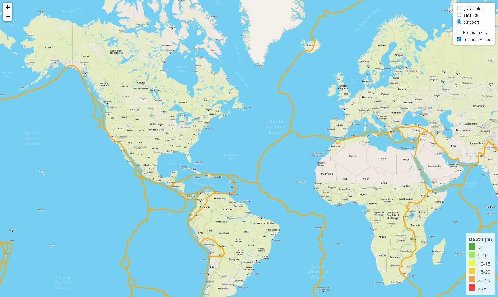

# Leaflet Homework - Visualizing Data with Leaflet

### Level 1: Basic Visualization

## Visualize the Earthquake Data Set.

1. **Get  data set**

   The USGS provides earthquake data in a number of different formats, updated every 5 minutes ([USGS GeoJSON Feed](http://earthquake.usgs.gov/earthquakes/feed/v1.0/geojson.php) ). The URL of the chosen JSON pulls in the data for the visualization.

  

2. **Import & Visualize the Data**

   Created a map using Leaflet that plots all of the earthquakes from the data set based on the longitude and latitude.

   * The data markers  reflect the magnitude of the earthquake by their size and the depth of the earthquake by color. 

   * Included are popups that provide additional information about the earthquake when a marker is clicked.

   * Created a legend that will provide context for the map data.

- - -

### Level 2: More Data (Optional)

Pulled in a second data set and visualized it along side  original set of data. Data on tectonic plates was found at <https://github.com/fraxen/tectonicplates>.

* Plotted a second data set the map (<https://github.com/fraxen/tectonicplates>).

* Configured three base maps to choose from as well as two different data sets into overlays that can be turned on and off independently.

* Added layer controls to the map.

- - -

